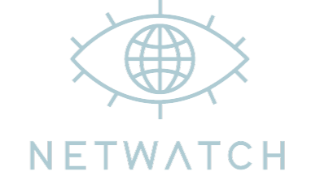

  

_A self-hosted network security reconnaissance platform_
# Table of Contents
- [About](#about)
  - [Components](#components)
- [Get Started](#get-started)
  - [Docker](#docker)
  - [Usage](#usage)
  - [Logging](#logging)
  - [API](#api)
# About
**Netwatch** is a self-hosted platform for continuous network reconnaissance and security monitoring.

It continuously scans your network for exposed ports, outdated software, and potential vulnerabilities. All gathered data is accessible through a RESTful HTTP API or a user-friendly web interface, where you can search for specific banners or identify outdated services. 

It fully supports both **IPv4 and IPv6**, just provide one or more subnets in CIDR notation or individual IP addresses and Netwatch will automatically start active monitoring with advanced service detection. Even if a host doesn't have a single open port it will still be stored in the database with the results of its auxiliary scripts (DNS blacklists, geolocation, etc.) and just to appear tuff there is also the possibility to generate and download PDF AI reports for hosts with open ports.

> Network scan results take time, that means you won't see any result at first because the scanning process needs to cycle through all the targets you've configured, analyze open ports, fingerprint services, and correlate potential vulnerabilities. Depending on the size of the network, this could take several minutes or even hours.
## Components
Netwatch is powered by several robust open-source tools:
- A custom-built TCP scanner, [**Netrunner**](src/netrunner.py) (wraps nmap & vulners)
- [**Nmap**](https://nmap.org/) for active scanning and enumeration with NSE
- [**Vulners**](https://vulners.com/) for CVE correlation
- Data storage using [**MongoDB**](https://www.mongodb.com)
- A minimal RESTful API built with [**FastAPI**](https://fastapi.tiangolo.com)
- A web dashboard implemented via [**Streamlit**](https://streamlit.io)
- AI analysis and reporting with [**Gemini**](https://gemini.google.com)<br>
> By default Netwatch scans the top 1000 ports for each host. This [list](src/static/ports.txt) is taken from [Shodan](https://www.shodan.io/) stats with the [following bash script](https://gist.github.com/komodoooo/38e1c1fc32e38eb3f0990f052538c708). Feel free to update, expand or reduce the list with your own favorite
# Get Started
Netwatch is deployable with Docker. Before starting, navigate into the `netwatch/install` directory and generate a new pair of credentials using `creds.sh`, then return to the main directory to start the installation.

> Credentials are hashed using bcrypt and stored in `/opt/netwatch/creds` during the container execution. Before running `creds.sh` ensure Python 3 and the bcrypt package are installed on your system.
## Docker
Ensure that you have enough hardware resources, a reliable network connection and [Docker](https://www.docker.com) installed on your system.<br>
Deployment is quick and easy using Docker Compose. Simply run the following command:

```bash
sudo docker compose up -d --build
```

This will start two containers and launch the entire platform.
## Usage
Once started, the web dashboard will be available at [localhost:8503](http://localhost:8503)

After the host discovery pre-scan (to see which hosts are alive) each scan is dinamically subdivided in chunks of about max **/28** _(16 hosts)_ subnets and then sequentially executed to avoid network throttling, with minimum parallelism of 48 concurrent operations per chunk _(len(chunk)*3)_

So if a single host is specified in the input field the minimum parallelism parameter would be just 3.
## Logging
Netwatch writes logs to `src/activity.log`

To access those logs inside the container:

```bash
sudo docker exec -it netwatch cat activity.log
```
## API
The full API documentation is available at [localhost:8504/docs](http://localhost:8504/docs)

> **Important:** The **auth-less** API and dashboard are accessible on your local network by default.  
> If you plan to expose Netwatch outside of your LAN, it is **highly recommended** to place it behind a **reverse proxy** (e.g., Traefik, Nginx) with **HTTPS and access controls** enabled exposing only the dashboard (port `8503`) to grant proper authentication.

> **Tip:** Need help identifying CIDR blocks for external hosts/networks of specific companies? You can use tools like [bgp.he.net](https://bgp.he.net/) to search for ASN or IP ranges ownership info.